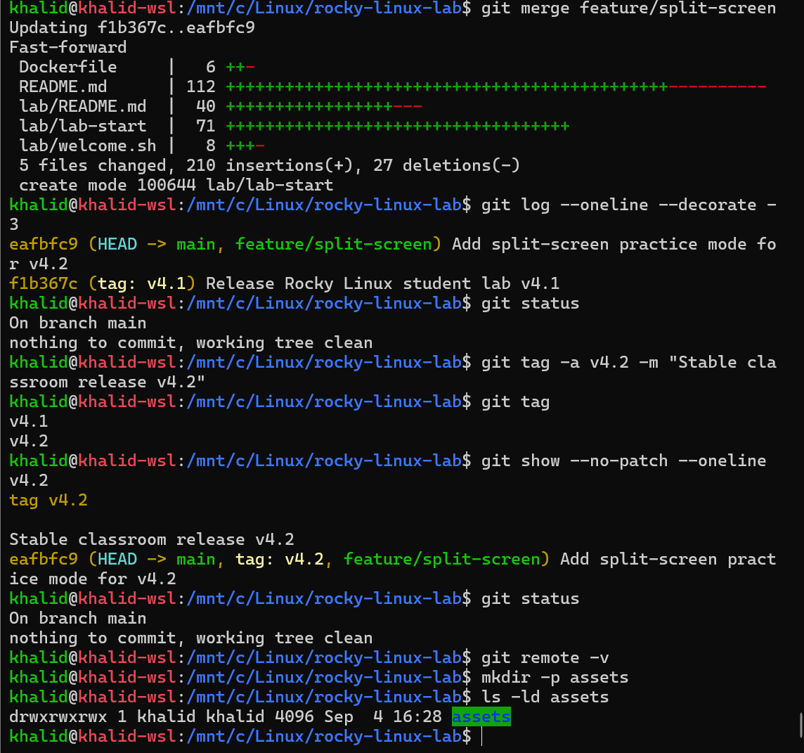

# 🐧 Rocky Linux Docker Student Practice Lab

A reusable **Rocky Linux 9 Docker-based hands-on lab** designed for students who want to practice Linux administration commands in a safe and repeatable environment.

The lab includes a ready-made practice environment, Linux administration and troubleshooting tools, a normal practice user, sample files and logs, and a complete workbook containing **100+ Linux commands and exercises**.

If the practice environment becomes messy, students can restore it anytime using:

```bash
lab-reset
```

---

# 🖼️ Project Preview

> Add your project image inside an `assets/` directory.

Recommended structure:

```text
assets/
└── rocky-linux-lab.png
```

Then this image will appear automatically:



---

# ✅ Prerequisites

Before starting the lab, make sure you have:

- Docker installed
- Docker daemon / Docker Desktop running
- Terminal or command-line access
- Internet connection for the initial Docker image pull

You do **not** need to install Rocky Linux manually.

---

# 🚀 Quick Start

## 1. Pull the Docker Image

```bash
docker pull krmaryum/rocky-linux-lab:4.2.1
```

## 2. Run the Lab for the First Time

```bash
docker run -it \
  --name rocky-linux-lab \
  --hostname rocky-lab \
  krmaryum/rocky-linux-lab:4.2.1
```

## 3. Switch to the Student User

```bash
su - labuser
```

## 4. Start Split-Screen Practice Mode

```bash
lab-start
```

The practice guide stays visible on the left while you run Linux commands on the right.

---

# 🔄 Starting the Lab Again

After the container has already been created, start it with:

```bash
docker start -ai rocky-linux-lab
```

Then:

```bash
su - labuser
lab-start
```

 Use `docker run` the first time.
> Use `docker start -ai` when the container already exists.

---

---

# 🚀 Docker Image

Docker Hub image:

```text
krmaryum/rocky-linux-lab
```

Stable classroom release:

Stable classroom versions should not be overwritten after students begin using them.

```text
krmaryum/rocky-linux-lab:4.2.1
```

Current stable tag:

```text
krmaryum/rocky-linux-lab:latest
```

For classroom use, the versioned tag is recommended:

```text
4.2
```

This keeps the student environment consistent even when future versions are released.

---

# ✨ Main Features
- Built-in split-screen practice mode with `lab-start`
- Rocky Linux 9 userspace
- Root administration access
- Normal practice user: `labuser`
- `labuser` belongs to the `wheel` group
- 100+ Linux command exercises
- Ready-made practice files and directories
- Sample log files
- CSV practice data
- Shell scripting examples
- File permission exercises
- Compression practice files
- Networking tools
- Process monitoring tools
- Text-processing utilities
- Cron tools
- Quick command reference with `lab-help`
- Complete lab reset with `lab-reset`
- Dynamic startup welcome screen
- Restricted passwordless sudo only for `lab-reset`
- Works with Docker Desktop, WSL, Linux, and PowerShell

---

# 📦 Pull the Docker Image

## Windows PowerShell

```powershell
docker pull krmaryum/rocky-linux-lab:4.2.1
```

## Linux / WSL / Bash

```bash
docker pull krmaryum/rocky-linux-lab:4.2.1
```

---

# ▶️ Run the Lab

## Windows PowerShell

```powershell
docker run -it --name rocky-linux-lab --hostname rocky-lab krmaryum/rocky-linux-lab:4.2.1
```

## Linux / WSL / Bash

```bash
docker run -it \
  --name rocky-linux-lab \
  --hostname rocky-lab \
  krmaryum/rocky-linux-lab:4.2.1
```

The container starts with a welcome screen explaining how to begin.

---

# 👨‍🎓 Start Practicing

The container initially starts as:

```text
root
```

For normal Linux practice, switch to:

```bash
su - labuser
```

Then move to the practice directory:

```bash
cd ~/linux-practice
```

Open the complete student workbook:

```bash
less README.md
```

The workbook contains more than 100 Linux commands and exercises.

Practice using this method:

```text
READ
  ↓
RUN
  ↓
OBSERVE
  ↓
PRACTICE
```

Press:

```text
q
```

to exit the `less` viewer.

---

# 🖥️ Keep the Command Sheet Visible While Practicing

A common problem while learning is:

```text
Open README
    ↓
Read command
    ↓
Press q
    ↓
README disappears
    ↓
Run command
```

A better method is to use **two terminal windows**.

## Terminal 1 — Keep the Practice Guide Open

Start the container:

```bash
docker start -ai rocky-linux-lab
```

Then:

```bash
su - labuser
cd ~/linux-practice
less README.md
```

Keep this terminal open.

---

## Terminal 2 — Practice the Commands

Open another PowerShell, WSL, or terminal window.

Check that the container is running:

```bash
docker ps
```

Enter the same running container:

```bash
docker exec -it rocky-linux-lab /bin/bash
```

Switch to the student user:

```bash
su - labuser
```

Move to the lab:

```bash
cd ~/linux-practice
```

Now the setup becomes:

```text
┌─────────────────────────────┐     ┌─────────────────────────────┐
│ Terminal 1                  │     │ Terminal 2                  │
│                             │     │                             │
│ README / Command Guide      │     │ Practice Shell              │
│                             │     │                             │
│ pwd                         │     │ $ pwd                       │
│ whoami                      │     │ /home/labuser/linux-practice│
│ ls -ltr                     │     │                             │
│ touch files/test.txt        │     │ $ whoami                    │
│ mkdir testdir               │     │ labuser                     │
│                             │     │                             │
│ Keep guide visible          │     │ Run commands here           │
└─────────────────────────────┘     └─────────────────────────────┘
```

This allows students to keep the command sheet visible while practicing.

---

# 🧭 Helpful Lab Commands

## Quick Linux Command Reference

```bash
lab-help
```

This displays a quick reference for common Linux commands.

---

## Reset the Practice Environment

```bash
lab-reset
```

This restores the original practice environment.

It recreates:

```text
sample files
directories
logs
CSV data
scripts
practice resources
README workbook
permissions
ownership
```

Students can freely experiment because the environment can always be reset.

---

# 📂 Practice Environment

The student lab is located at:

```text
/home/labuser/linux-practice
```

Example structure:

```text
linux-practice/
│
├── README.md
├── files/
├── logs/
├── scripts/
├── backup/
├── data/
├── users/
├── temp/
├── projects/
└── compress_me/
```

---

# 📄 Practice Files

The lab automatically creates files such as:

```text
employees.txt
fruits.txt
story.txt
numbers.txt
secure.txt
bigfile.img
```

---

# 📊 CSV Practice

Example:

```text
data/students.csv
```

Useful for practicing:

```text
awk
cut
sort
grep
```

---

# 📜 Log Practice

Example:

```text
logs/system.log
```

Students can practice:

```bash
grep
egrep
tail
head
awk
sed
```

---

# 🐚 Shell Script Practice

Example script:

```text
scripts/hello.sh
```

Students can practice:

```text
Bash
permissions
execution
script troubleshooting
```

---

# 🧪 Linux Topics Covered

The practice workbook includes exercises for:

## Navigation

```bash
pwd
whoami
date
ls
ls -ltr
cd
```

---

## File Creation and Deletion

```bash
touch
rm
mkdir
rmdir
```

---

## Copy, Move, and Rename

```bash
cp
mv
```

---

## File Viewing

```bash
cat
less
more
head
tail
```

---

## Searching

```bash
grep
egrep
find
```

---

## Sorting and Unique Values

```bash
sort
uniq
```

---

## Counting

```bash
wc
```

---

## Randomization

```bash
shuf
```

---

## Splitting Files

```bash
split
```

---

## Comparing Files

```bash
cmp
diff
```

---

## Text Processing

```bash
awk
cut
sed
tr
fold
```

---

## Compression

```bash
gzip
gunzip
tar
zip
unzip
```

---

## Process Management

```bash
ps
jobs
bg
fg
pkill
top
```

---

## System Information

```bash
hostname
uname
lscpu
free
df
du
```

---

## Networking

```bash
ip
ss
ping
curl
wget
netstat
ifconfig
dig
nslookup
traceroute
```

---

## Environment Variables

```bash
export
echo
printenv
```

---

## Aliases

```bash
alias
```

---

## Scheduling

```bash
crontab
crond
```

---

## User Management

```bash
useradd
passwd
id
userdel
```

---

## Permissions

```bash
chmod
chown
chgrp
```

---

# 🛠️ Included Linux Tools

The image contains tools such as:

```text
vim
nano
curl
wget
ip
ss
ping
netstat
ifconfig
ps
top
free
vmstat
sudo
ssh
scp
find
grep
awk
sed
tar
gzip
zip
unzip
tree
lsof
dig
nslookup
traceroute
rsync
tmux
file
clear
cmp
diff
crontab
crond
```

---

# 👤 Root and `labuser`

The container starts as:

```text
root
```

For normal student practice:

```bash
su - labuser
```

The `labuser` account belongs to:

```text
wheel
```

This allows students to practice sudo after configuring a password.

---

# 🔐 Restricted Passwordless Sudo

The lab does **not** give:

```text
NOPASSWD:ALL
```

Instead, passwordless sudo is allowed only for:

```text
lab-reset
```

The sudo rule is:

```text
labuser ALL=(root) NOPASSWD: /usr/local/bin/lab-reset
```

This means students can reset the lab without receiving unrestricted root access.

---

# 🔑 Practice Normal Sudo

If you want to practice normal sudo authentication, as root run:

```bash
passwd labuser
```

Then:

```bash
su - labuser
```

Test:

```bash
sudo whoami
```

Expected:

```text
root
```

---

# ⏰ Cron Practice

The image includes:

```text
crontab
crond
```

Because this is a Docker container, `systemd` is not normally running as PID 1.

For cron practice, start it manually as root:

```bash
crond
```

Then:

```bash
crontab -e
```

---

# ⚠️ Docker Container vs Rocky Linux VM

This Docker lab is excellent for practicing:

```text
Linux commands
files and directories
users and groups
permissions
text processing
shell scripting
process management
network troubleshooting tools
compression
environment variables
cron commands
basic administration
```

For deeper system administration, use a full Rocky Linux virtual machine for:

```text
systemd
systemctl
SELinux
firewalld
boot process
kernel administration
LVM
device management
full host networking
```

---

# 🔄 Exit and Restart the Lab

If you run:

```bash
exit
```

the main Bash process may stop the container.

The container is not automatically deleted.

Check:

```bash
docker ps -a
```

Restart it:

```bash
docker start -ai rocky-linux-lab
```

---

# ❗ Container Name Already Exists

You may see:

```text
Conflict. The container name "/rocky-linux-lab" is already in use
```

This means an existing stopped or running container already has that name.

Check:

```bash
docker ps -a --filter "name=rocky-linux-lab"
```

If you no longer need the old container:

```bash
docker rm -f rocky-linux-lab
```

Then create a fresh container:

```bash
docker run -it \
  --name rocky-linux-lab \
  --hostname rocky-lab \
  krmaryum/rocky-linux-lab:4.2.1
```

---

# 🏗️ Build the Image Locally

Clone the GitHub repository:

```bash
git clone YOUR-GITHUB-REPOSITORY-URL
```

Move into the project:

```bash
cd rocky-linux-lab
```

Build:

```bash
docker build \
  -t rocky-linux-lab:local \
  .
```

Run:

```bash
docker run -it \
  --name rocky-linux-lab-local \
  --hostname rocky-lab \
  rocky-linux-lab:local
```

---

# 📁 GitHub Repository Structure

```text
rocky-linux-lab/
│
├── Dockerfile
├── README.md
├── .gitignore
│
├── assets/
│   └── rocky-linux-lab.png
│
└── lab/
    ├── README.md
    ├── linux-practice.sh
    ├── lab-help
    ├── lab-reset
    ├── lab-start
    └── welcome.sh
```

---

# 📘 Two Different README Files

This project intentionally contains two README files.

## Root README

```text
README.md
```

Purpose:

```text
GitHub project documentation
Docker usage
project explanation
installation
troubleshooting
```

---

## Student Workbook

```text
lab/README.md
```

Purpose:

```text
100+ Linux practice commands
student exercises
practice sequence
```

During the Docker build, the student workbook is copied into:

```text
/home/labuser/linux-practice/README.md
```

---

# 🧩 Important Project Files

| File | Purpose |
|---|---|
| `Dockerfile` | Builds the Rocky Linux Docker image |
| `README.md` | GitHub project documentation |
| `lab/README.md` | Student Linux practice workbook |
| `lab/linux-practice.sh` | Creates the practice environment |
| `lab/lab-help` | Quick Linux command reference |
| `lab/lab-reset` | Restores the practice environment |
| `lab/lab-start` | Opens the tmux split-screen practice environment |
| `lab/welcome.sh` | Displays startup instructions |
| `.gitignore` | Prevents unnecessary files from entering Git |

---

# 🏷️ Versioning Policy

The project follows simple versioning:

```text
4.1
→ previous stable classroom release

4.2
→ introduced split-screen practice mode
→ published for linux/arm64

4.2.1
→ current stable classroom release
→ multi-platform: linux/amd64 + linux/arm64

latest
→ current newest stable release
```
---

# 🖥️ Built-in Split-Screen Practice Mode

Version `4.2` introduced the `lab-start` command, and it remains available in `4.2.1`.

Run:

```bash
lab-start
```

This opens:

```text
┌───────────────────────┬───────────────────────┐
│ Practice Guide        │ Student Shell         │
│                       │                       │
│ pwd                   │ $ pwd                 │
│ whoami                │ $ whoami              │
│ ls                    │ $ ls                  │
│ touch                 │ $ touch ...           │
└───────────────────────┴───────────────────────┘
```

The guide remains visible while the student runs commands in the practice shell.

If the tmux session is detached, running `lab-start` again reconnects to the existing session.

---

# 🎯 Learning Goal

The purpose of this project is to create a safe environment where students can:

```text
Learn
  ↓
Practice
  ↓
Make mistakes
  ↓
Troubleshoot
  ↓
Reset
  ↓
Practice again
```

The main learning philosophy is:

```text
READ → RUN → OBSERVE → PRACTICE
```

---

# 🐳 Docker Hub

Repository:

```text
krmaryum/rocky-linux-lab
```

Recommended classroom image:

```text
krmaryum/rocky-linux-lab:4.2.1
```

---

# 🤝 Contributions

Suggestions and improvements are welcome.

Possible future improvements include:

- additional Linux troubleshooting exercises
- networking labs
- process troubleshooting labs
- storage exercises
- permissions challenges
- shell scripting exercises
- interview practice scenarios

---

# 🐧 Happy Linux Learning!

Practice regularly.

Break things safely.

Understand why commands work.

Troubleshoot problems.

Reset the lab.

Practice again.
